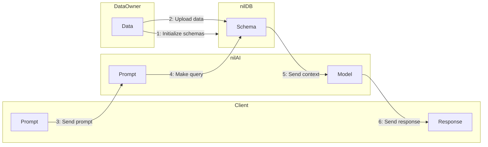
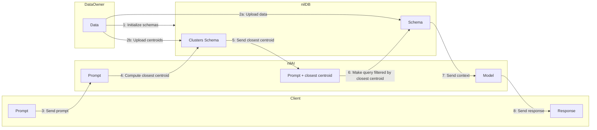

# nilRAG [](https://badge.fury.io/py/nilrag) [](https://github.com/NillionNetwork/nilrag/blob/main/LICENSE)

Retrieval Augmented Generation (RAG) using Nillion's
[nilAI](https://github.com/NillionNetwork/nilAI),
[nilDB](https://github.com/NillionNetwork/nildb), and
[nilQL](https://github.com/NillionNetwork/nilql-py). RAG is a technique that
grants large language models information retrieval capabilities and context that
they might be missing.

nilRAG combines multiparty computation (MPC) and trusted execution environment
(TEE) technologies.

# Overview

Data owners often possess valuable files that clients wish to query to enhance
their LLM-based inferences. However, ensuring privacy is a key challenge: data
owners want to keep their data confidential, and clients are equally concerned
about safeguarding their queries.

nilRAG addresses this challenge by enabling secure data sharing and querying. It
allows data owners to store their data securely in a nilDB cluster while
allowing clients to query the data without exposing their queries or
compromising the data's privacy.

The process involves leveraging a Trusted Execution Environment (TEE) server for
secure computation through nilAI. Data owners upload their information to the
nilDB cluster, while nilAI processes client queries and retrieves the most
relevant results (top-k) without revealing sensitive information from either
party.

## Entities summary

Let us deep dive into the entities and their roles in the system.

1) **Data Owners:** Secure stores files for RAG Data owners contribute multiple
files, where each file contains several paragraphs. Before sending the files to
the nilDB instances, they are processed into N chunks of data and their
corresponding embeddings:
    ```
    Chunks (ch_i): Represented as encoded strings.
    Embeddings (e_i): Represented as vectors of floats (fixed-point values).
    ```

    Once the files are encoded into chunks and embeddings, they are blinded before being uploaded to the NilDB, where each chunk and embedding is secret-shared.

2) **Client:** A client submits a query q to search against the
data owners' files stored in NilDB and perform RAG (retrieve the most relevant data and use the top-k results for privacy-preserving machine learning (PPML) inference).

    Similar to the data encoding by data owners, the query is processed into its corresponding embeddings:

3) **NilDB:** Secure Storage and Query Handling

    NilDB stores the blinded chunks and embeddings provided by data owners. When a client submits a query, NilDB computes the differences between the query's embeddings and each stored embedding in a privacy-preserving manner:
    ```python
    differences = [embedding - query for embedding in embeddings]
    ```

    Key Points:
    - The number of differences (N) corresponds to the number of chunks uploaded by the data owners.
    - For secret-sharing-based NilDB, the computation is performed on the shares.

4) **nilAI:** Secure Processing and Retrieval 

    The nilTEE performs the following steps:

    1. Retrieve and Reveal Differences: Connect to NilDB to fetch the blinded
       differences and then reveal the differences by reconstructing shares.

    2. Identify Top-k Indices: Sort the differences while retaining their
       indices to find the `top_k` matches:
        ```python
        indexed_diff = list(enumerate(differences))
        sorted_indexed_diff = sorted(indexed_diff, key=lambda x: x[1])
        indices = [x[0] for x in sorted_indexed_diff]
        k = 5
        top_k_indices = indices[:k]
        ```

    3. Fetch Relevant Chunks: Request NilDB to retrieve the blinded chunks
       corresponding to the `top_num_chunks_ids`.

    4. Prepare for Inference: Combine the retrieved `top_num_chunks_ids` with the
       original query. Use the data with an LLM inside the nilTEE for secure
       inference.

# How to use

## Installation
First install [uv](https://docs.astral.sh/uv/getting-started/installation/), then run:
```shell
# Create and activate virtual environment with uv
uv venv
source .venv/bin/activate
```

Then either follow the local installation:
```shell
# Install package in development mode
uv pip install -e .
```
or use `pip`:
```shell
pip install nilrag
```

## Data owner

### Initialization

First follow these three steps:
- Register a new organization in Nillion's [SecretVault Registration
Portal](https://sv-sda-registration.replit.app/).
- After you get your nilDB credentials, copy `.env.sample` to `.env` and store your credentials.
- **Note for Data Owners:** If you haven't configured your schemas yet, you can safely disregard the following: `SCHEMA_ID`, `CLUSTERS_SCHEMA_ID`, and `QUERY_ID`.

```shell
cp .env.sample .env
```

You are now ready to create your initial schema and query template for RAG. The data owner has the option to use clustering, which involves a trade-off between speed and accuracy. At a minimum,
they should look like:
1. `schema`: which is the structure of the data that the data owner will store.
    In this case each entry has a `chunk` (`string`), an `embedding` (`vector<integer>`)
    and, optionally, the `cluster_centroid` (`vector<integer>`) where
    the `embedding` belongs. Each data owner will upload multiple `chunk`s
    and `embedding`s, and optionally, `cluster_centroid`s.
2. `query`: A nilDB query that securely computes, via MPC, the difference between the data
    owner's  stored embeddings and the client's embedding. When clustering is enabled, a variant of this query filters by `cluster_centroid` to minimize data transfer.
3. `clusters_schema`: This is a data structure where the data owner stores 
    `cluster_centroid`s when clustering is performed.
    Each data owner may choose to upload multiple `cluster_centroid`s.

#### Examples

Please refer to the [examples/init](examples/init) folder for an example showing how to initialize a schema, a query, 
and a `clusters_schema` (if clustering is enabled). One example uses the built-in bootstrap functions, while the other 
illustrates how to initialize the schemas and query separately. Both methods will populate the `SCHEMA_ID`, 
`CLUSTERS_SCHEMA_ID`, and `QUERY_ID` fields in your `.env` file. Ensure that these fields have been populated successfully.

##### Bootstrap
```shell
# Use default env file and no clustering
uv run examples/init/bootstrap.py

# Or specify a custom env file and clustering option
uv run examples/init/bootstrap.py --env-path .env --with-clustering
```


### Uploading Documents
After initialization, the data owner can upload their documents to nilDB. We provide an example of how to do this in
[examples/data_owner/write.py](examples/data_owner/write.py).

By running the script, the documents are uploaded to the nilDB instance in secret-shared form:
```shell
# Use default env file and no clustering
uv run examples/data_owner/write.py

# Or specify custom config, data files, number of clusters, and chunk size to store the data
uv run examples/data_owner/write.py --file /path/to/data.txt --num-clusters NUMBER_CLUSTERS --chunk-size CHUNK_SIZE
```

#### Delete all data
We provide an example on how to delete all data (flush) from the schemas provided in nilDB. The cluster schema data is also deleted if `CLUSTERS_SCHEMA_ID` is not `None` or not the empty string.

To run the flush example [flush example](examples/data_owner/flush.py), run the following command
```shell
# Use default env file and no clustering
uv run examples/data_owner/flush.py
```


## Client Query
After having nilDB initialized, documents uploaded, and access to nilAI, the
client can query the nilDB instance. We provide an example of how to do this in
[examples/client/query.py](examples/client/query.py).

By running the script, the client's query is sent to nilAI and the response is
returned:
```shell
# Use default config and prompt
uv run examples/client/query.py

# Or specify custom config and prompt
uv run examples/client/query.py --prompt "Your custom query here"
```

## Running Benchmarks on RAG using nilDB nodes
After having nilDB initialized, documents uploaded, the
client run benchmarks to measure the time it takes to perform RAG using nilDB nodes.
The response is the most relevant data chunks for a given query.

```shell
# Use default config and prompt
uv run benchmarks/nilrag_nildb_nodes.py

# Or specify custom config and prompt
uv run benchmarks/nilrag_nildb_nodes.py --prompt "Your custom query here"
```

## Running Tests
```shell
# Run a specific test file
uv run -m unittest test.rag
```

Note: `test_top_num_chunks_execute` test is optional and not run by default.

## Flowchart

### Full flow with no clustering

Schematically, this shows the full flow from initializing schemas to making queries, in the case where no clustering is performed by the Data Owner at the time of uploading data to nilDB.



### Full flow with clustering

This shows the full flow from initializing schemas to making queries, in the case where clustering is performed by the Data Owner at the time of uploading data to nilDB.




## Repo structure

```
├── benchmarks
│   └── nilrag_nildb_nodes.py
├── examples
│   ├── client
│   │   └── query.py
│   ├── data
│   │   ├── 20-fake.txt
│   │   ├── cities.txt
│   │   ├── climate-change.txt
│   │   └── computer-science.txt
│   ├── data_owner
│   │   ├── flush.py
│   │   └── write.py
│   ├── init
│   │   ├── bootstrap.py
│   │   └── manual.py
│   └── synthetic_data.py
├── pyproject.toml
├── src
│   └── nilrag
│       ├── __init__.py
│       ├── config.py
│       ├── nildb
│       │   ├── __init__.py
│       │   ├── initialization.py
│       │   ├── operations.py
│       │   ├── org_config.py
│       │   └── aux_files
│       │       ├── rag_schema.json
│       │       ├── clusters_schema.json
│       │       ├── subtract_query.json
│       │       └── subtract_query_with_clustering.json
│       ├── rag_vault.py
│       └── utils
│           ├── __init__.py
│           ├── benchmark.py
│           ├── process.py
│           └── transform.py
└── test
    ├── __init__.py
    └── rag.py
```